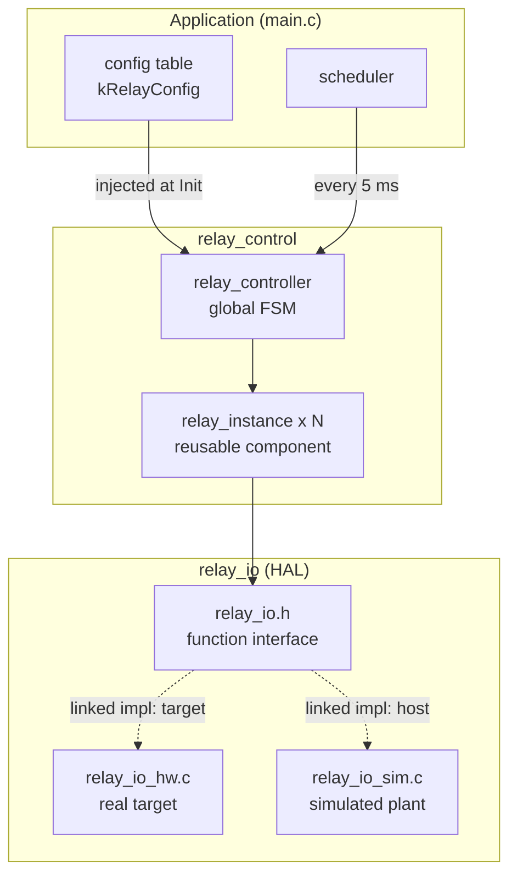
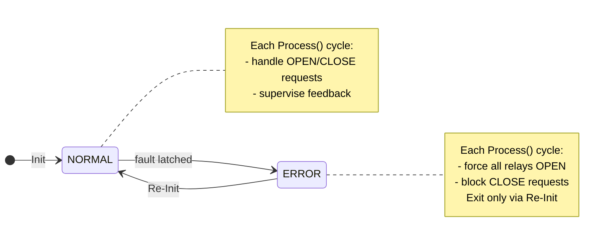
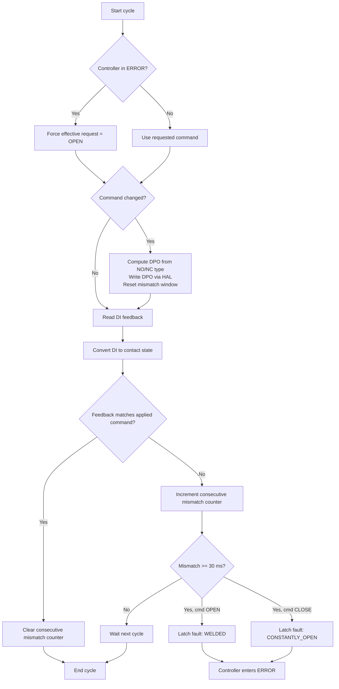

# Architecture diagrams

Mermaid and PlantUML diagrams for the BR ESW relay controller solution.

Full solution write-up (overview, assumptions, timing, demo, build):
[BR_ESW_Relay_Controller_Solution.txt](BR_ESW_Relay_Controller_Solution.txt)

**PlantUML sources:** [docs/plantuml/](plantuml/) — render with
[PlantUML](https://plantuml.com/), VS Code PlantUML extension, or
`java -jar plantuml.jar docs/plantuml/*.puml`.

---

## Module decomposition

Three software layers: application injects configuration and drives the periodic
task; `relay_control` owns the global FSM and one reusable `RelayInstance` per
relay; `relay_io` provides DPO/DI access. Exactly one HAL implementation
(`relay_io_hw.c` or `relay_io_sim.c`) is linked at build time.

Mermaid

PlantUML — <code>plantuml/module_decomposition.puml</code>

Source: [module_decomposition.puml](plantuml/module_decomposition.puml)

| Layer | Module | Responsibility |
|-------|--------|----------------|
| Application | `main.c`, `scheduler` | Config table, `RelayIo_Init`, schedule, generate requests |
| Controller | `relay_controller` | Global state machine, error reaction |
| Component | `relay_instance` | Per-relay command + supervision |
| HAL | `relay_io` | DPO/DI access; one impl linked (hw or sim) |

---

## Scheduling and timing

Each call to `Scheduler_RunTask()` represents **one 5 ms task period**: it invokes
`RelayController_Process()` once and advances the tick counter. One task period
equals one execution of the per-relay flowchart below.

On the **host demo**, `main.c` calls `Scheduler_RunTask()` inside a loop as fast
as the CPU allows. Ticks are **logical** time steps (tick 0, 1, 2, …), where
each tick stands for 5 ms — not wall-clock delay.

On the **target MCU**, the same function would be called from a **hardware timer
interrupt** or a **periodic RTOS task** (e.g. every 5 ms). The scheduler module
is a cyclic executive; the RTOS or timer provides real-time triggering.

Timing supervision (30 ms fault window, bounce filtering) uses **cycle counters**
derived from `kRelayTaskPeriodMs` in `common.h` — no runtime millisecond timers
are required inside the controller.

---

## Controller state diagram

Global controller FSM. Faults latch the controller into **ERROR**. The only
recovery path is **Re-Init** — a new call to `RelayController_Init()`, which
resets controller state to **NORMAL** and re-initialises all instances.

Mermaid

PlantUML — <code>plantuml/controller_state.puml</code>

Open [controller_state.puml](plantuml/controller_state.puml).

---

## Per-relay execution flow

One task cycle inside `RelayController_Process()`. When the controller is in
**ERROR**, every relay receives an effective **OPEN** command regardless of the
requested state. Fault detection compares the **applied** command against
sampled feedback every cycle; six **consecutive** mismatch cycles (30 ms) are
required before latching. Any matching sample clears the mismatch run, so
alternating bounce (wrong, right, wrong, right, …) cannot accumulate into a
false fault.

Mermaid

PlantUML — <code>plantuml/per_relay_flow.puml</code>

Open [per_relay_flow.puml](plantuml/per_relay_flow.puml).

