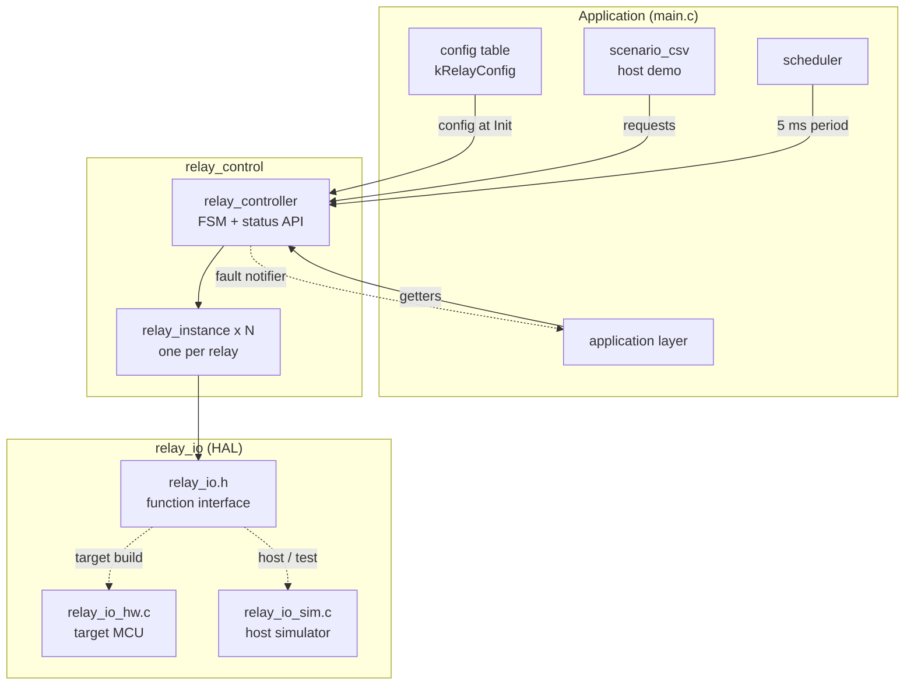
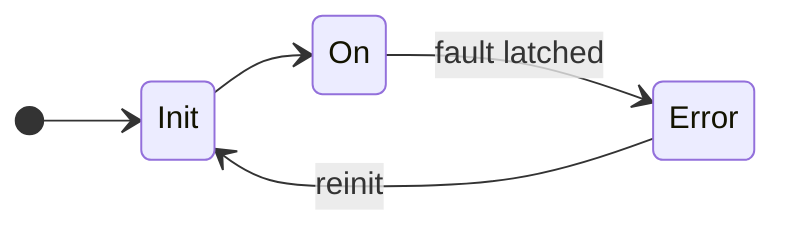
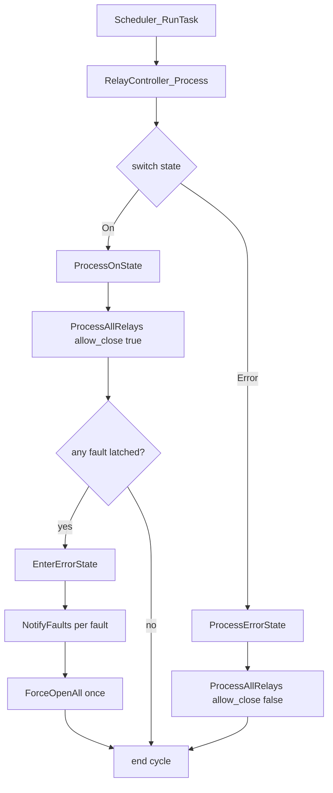
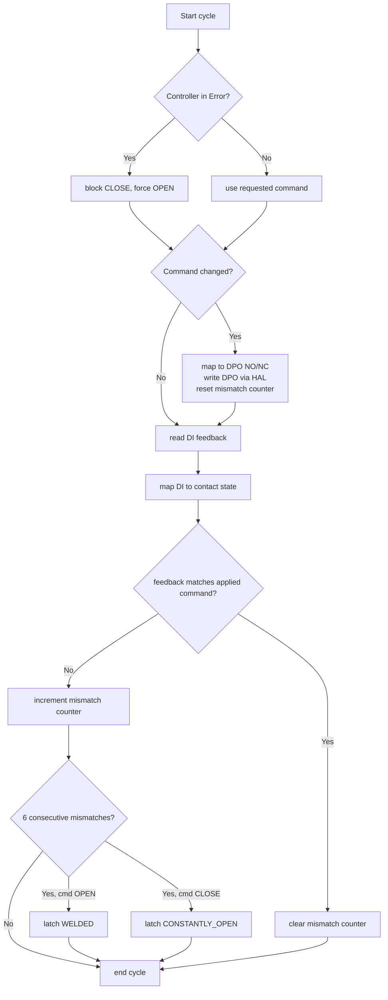

# Architecture diagrams

Diagrams for the relay controller solution

PlantUML sources are in [docs/plantuml/](plantuml/). Rendered PNGs are in [docs/diagram_images/](diagram_images/).

---

## Module decomposition

The code splits into three parts. 
`Application` holds the relay config table, loads the simulation parameters, and runs the periodic scheduler.
`Relay control` contains the global FSM and one `relay_instance` per relay.
`Relay HAL` is the HAL — on the target `relay_io_hw.c`, on the host the `relay_io_sim.c` simulator. 

<details>
<summary>Mermaid</summary>



</details>

<details>
<summary>PlantUML — <code>plantuml/module_decomposition.puml</code></summary>

Source: [module_decomposition.puml](plantuml/module_decomposition.puml)

</details>

| Layer | Module | Responsibility |
|-------|--------|----------------|
| Application | `main.c`, `scheduler`, `scenario_csv` | Config, init, schedule, demo |
| Controller | `relay_controller` | Global FSM, error reaction, status API, optional fault notifier |
| Component | `relay_instance` | Per-relay command and supervision |
| HAL | `relay_io` | DPO/DI access (hw or sim, one per build) |

---

## Scheduling and timing

`Scheduler_RunTask()` is one 5 ms task period: it calls
`RelayController_Process()` once and bumps the tick counter. That is one
controller execution cycle. Every relay runs the per-relay flow inside that cycle.

On the host demo, `main.c` calls it in a loop as fast as the CPU allows. Each
loop iteration is a logical tick (0, 1, 2, …) representing 5 ms — there is no
real-time delay.

On the target MCU the same function would run from a periodic RTOS task every 5 ms.
The scheduler module is a cyclic executive; the timer or RTOS provides the actual timing.

Fault detection uses cycle counters from `kRelayTaskPeriodMs` in `relay_types.h`
(6 cycles = 30 ms). No millisecond timers are needed inside the controller.

---

## Controller state diagram

The controller has three states: **Init**, **On**, and **Error**.

**Init** — entered at startup. `RelayController_Init()` resets the controller, 
drives every relay OPEN (safe state), and clears faults before any open/close
requests are processed. Then the controller moves to On.

**On** — regular operation. Each `Process()` cycle applies OPEN/CLOSE requests
and supervises feedback. If any relay latches a fault, the controller transitions
to Error.

**Error** — safe reaction. All relays are forced OPEN, CLOSE requests are ignored,
and the controller stays here until re-init. 

Transitions on the diagram:
- **Init → On** — init completed
- **On → Error** — fault latched on any relay
- **Error → Init** — re-init
- then **Init → On** again when init completes

<details>
<summary>Mermaid</summary>



</details>

<details>
<summary>PlantUML — <code>plantuml/controller_state.puml</code></summary>

Open [controller_state.puml](plantuml/controller_state.puml).

</details>

---

## Controller execution flow

One 5 ms task period. `Scheduler_RunTask()` calls `RelayController_Process()`
once. This diagram is the controller level; each pass through
`RelayInstance_Process()` is detailed in the per-relay flow below.

`RelayController_Process()` dispatches on `_state`:

- **On** — `ProcessOnState()`: run every relay with `allow_close = true`, then
  if any fault is latched call `EnterErrorState()` (On → Error entry action:
  log, set state to Error, `NotifyFaults()` once per faulted relay,
  `ForceOpenAll()` once).
- **Error** — `ProcessErrorState()`: run every relay with `allow_close = false`
  so CLOSE requests are treated as OPEN. `ForceOpenAll()` runs only on the transition into Error.

The runtime enum has **On** and **Error** only. **Init** is the one-shot bootstrap
in `RelayController_Init()` (each `RelayInstance_Init()` drives OPEN and clears
faults before the first `Process()` call).

<details>
<summary>Mermaid</summary>



</details>

<details>
<summary>PlantUML — <code>plantuml/controller_process.puml</code></summary>

Open [controller_process.puml](plantuml/controller_process.puml).

</details>

---

## Per-relay execution flow

The diagram shows one 5 ms cycle for a single relay inside
`RelayController_Process()`. The controller calls `RelayInstance_Process()` for
each relay in turn. Fault detection compares the **applied** command on the DPO with the DI feedback.

### Step by step

1. **Start cycle** — one call to `RelayInstance_Process()` for a relay.

2. **Controller in Error?** — if yes, CLOSE is blocked and the effective
   command is OPEN. If no, use the requested command.

3. **Command changed?** — if the effective command differs from the last
   applied command:
   - map OPEN/CLOSE to DPO level (NO or NC type)
   - write DPO via `relay_io`
   - reset the mismatch counter

4. **Read feedback** — sample DI and convert to contact state (DI high =
   closed, DI low = open).

5. **Feedback matches applied command?**
   - **Yes** — clear the mismatch counter and end this cycle for this relay.
   - **No** — go to step 6.

6. **Increment mismatch counter** — count only consecutive mismatches. Any
   matching sample in a later cycle resets the counter (handles contact
   bounce).

7. **Six consecutive mismatches?** — at 5 ms per cycle, that is 30 ms. If not reached yet, 
    end the cycle and check again next tick.

8. **Latch fault on this relay:**
   - applied command OPEN, feedback still closed → **WELDED**
   - applied command CLOSE, feedback still open → **CONSTANTLY_OPEN**

9. **Controller reaction** (after all relays are processed in the same
   `Process()` call) — if any relay has a latched fault, the controller
   enters Error and calls `ForceOpenAll()` to drive every relay OPEN.

Fault stays latched on the instance until `RelayController_Init()` (re-init).

<details>
<summary>Mermaid</summary>



</details>

<details>
<summary>PlantUML — <code>plantuml/per_relay_flow.puml</code></summary>

Open [per_relay_flow.puml](plantuml/per_relay_flow.puml).

</details>

---

## Status API

### Poll (primary)

Other modules read relay and controller state through the public getters:

| API | Returns |
|-----|---------|
| `RelayController_GetContactState()` | Last sampled contact: open / closed |
| `RelayController_GetFault()` | Latched fault: none / welded / constantly open |
| `RelayController_GetRequest()` | Stored open/close request for the relay |
| `RelayController_GetState()` | Global controller state: On / Error |

The controller updates these values every `Process()` cycle. The application reads
them after `Scheduler_RunTask()` or from a lower-priority task.

### Optional fault notifier

```c
void MyFaultHandler(uint8_t relay_id, RelayFault fault, void *context);

RelayController_SetFaultNotifier(&controller, MyFaultHandler, my_context);
```

When the controller enters **Error**, `EnterErrorState()` calls the notifier **once
per faulted relay**. This is an example of optional push notification; the same
pattern could be extended to report per-relay contact or other state changes via
callback. Routine status remains available through the getters above.

<details>
<summary>PlantUML — <code>plantuml/fault_notification.puml</code></summary>

Open [fault_notification.puml](plantuml/fault_notification.puml).

</details>

### NO / NC DPO mapping

| Relay type | CLOSE (energized) | OPEN (de-energized) |
|------------|-------------------|---------------------|
| NO         | DPO HIGH          | DPO LOW             |
| NC         | DPO LOW           | DPO HIGH            |

| Command | Expected DI feedback |
|---------|----------------------|
| CLOSE   | DI HIGH (closed)     |
| OPEN    | DI LOW (open)        |
